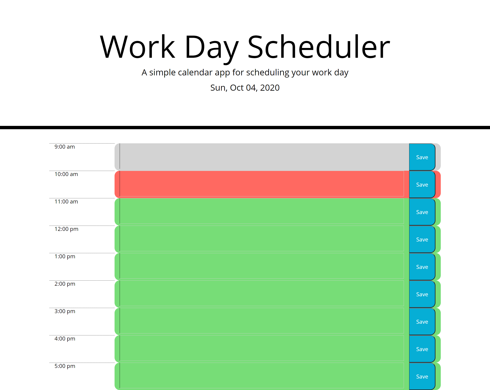
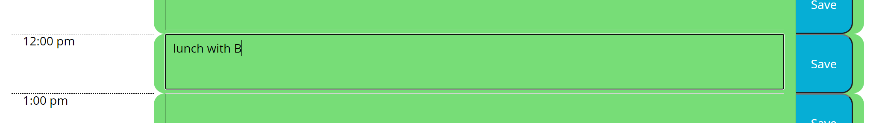
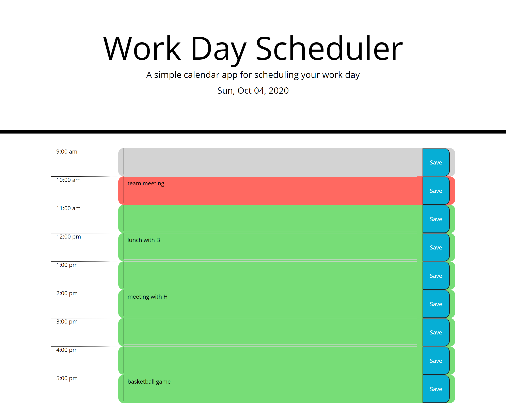

# jQuery Workday Scheduler

## Table of Contents

* [Description](#description)
* [Links](#links)
* [Screenshots](#screenshots)
* [Installation Instructions](#installation-instructions)
* [Usage](#usage)
* [Technologies Used](#technologies-used)
* [Tests](#tests)
* [Credits](#credits)
* [Contributing](#contributing)
* [Questions](#questions)
* [Badges](#badges)

## Description

This is an hour-by-hour workday planner using jQuery. The user will see the current date displayed at the top of the page, with a series of time blocks below. The time blocks are color-coded based on whether they are past (gray), present (red), or future (green). To enter an event into the scheduler, the user will click on the text area in the appropriate time block and type in their event, then click the "Save" button. The information will persist across page reloads.

## Screenshots

Blank scheduler:

Active user input area:

Scheduler with events scheduled:

## Usage

This project is intended to be used to help the user manage their time by allowing them to enter scheduled events during the current workday.

## Technologies Used

   

## Tests

npm run test

## Credits

Base code and styling developed and provided by 2U/Trilogy Education Services

